# java-lotto

## 프로젝트 소개
- 콘솔에서 진행되는 로또 구매 및 당첨 통계 계산 프로그램입니다.
- 사용자가 구입 금액과 당첨 번호를 입력하면, 로또 번호를 자동으로 발행하고 당첨 결과와 수익률을 출력합니다.
- `camp.nextstep.edu.missionutils` 라이브러리를 활용해 콘솔 입력과 중복 없는 난수 생성을 수행합니다.

## 주요 기능
- 구입 금액 입력 및 검증: 숫자 여부, 1,000원 단위, 최소 금액을 검증해 안전한 게임 시작을 보장합니다.
- 로또 자동 발행: Mission Utils 난수 유틸을 사용해 1~45 범위의 중복 없는 6개 숫자를 생성하고 오름차순으로 정렬합니다.
- 당첨 번호 및 보너스 번호 검증: 쉼표 구분 입력을 파싱하고 범위·중복 조건을 확인합니다.
- 당첨 통계 산출: 각 로또의 등수를 계산해 합산하고 총 수익률을 소수 첫째 자리까지 반올림해 제공합니다.

## 기능 목록
- 입력: 구입 금액을 콘솔로 받아 숫자, 양수, 1,000원 단위 여부를 확인합니다.
- 발행: 구입 금액만큼 자동 로또를 생성하고 각 번호를 오름차순으로 정렬합니다.
- 당첨 번호 입력: 쉼표로 구분된 6개의 숫자를 받아 범위와 중복을 검증한 뒤 `Lotto`로 래핑합니다.
- 보너스 번호 입력: 단일 숫자를 받아 범위 및 당첨 번호와의 중복 여부를 검증합니다.
- 등수 계산: 발행된 각 로또가 당첨 번호와 몇 개 일치하는지 계산하고 `WinningCriteria`를 결정합니다.
- 통계 출력: 등수별 당첨 개수와 총 수익률을 포맷팅해 출력합니다.
- 예외 처리: 위 과정 중 잘못된 입력이 발생하면 `[ERROR]` 메시지를 출력하고 해당 단계부터 재입력 받습니다.

## 실행 환경
- Java 21 (Gradle Toolchain으로 자동 설정)
- Gradle Wrapper 8.x
- Mission Utils 1.2.0

## 실행 방법
1. 저장소 루트에서 Gradle Wrapper 실행 권한을 부여합니다.
   ```bash
   chmod +x gradlew
   ```
2. 테스트 실행
   ```bash
   ./gradlew clean test
   ```
3. 애플리케이션 실행  
   현재는 Gradle `application` 플러그인을 사용하지 않으므로 IDE에서 `lotto.Application`의 `main` 메서드를 실행하거나, 직접 빌드 후 `java -cp` 방식으로 실행합니다.

## 클래스 다이어그램

```mermaid
---
config:
  layout: elk
  elk:
    nodePlacementStrategy: BRANDES_KOEPF
---
classDiagram
    direction TD
    class LottoApplication {
        +main(String[] args)
    }
    LottoApplication --> LottoGameController : creates & injects
    LottoApplication --> GameFacade : creates
    LottoApplication --> LottoService : creates
    LottoApplication --> WinningService : creates
    LottoApplication --> InputAdapter : creates
    LottoApplication --> OutputView : creates
    LottoApplication --> RandomLottoGenerator : creates
    LottoApplication --> UserInputWinningNumbersProvider : creates
    LottoApplication --> BasicProfitCalculator : creates
    class InputAdapter {
        <<Input Adapter>>
        +inputPurchaseAmount() String
        +inputWinningNumbers() String
        +inputBonusNumber() String
    }
    class OutputView {
        +printLottos(List~Lotto~)
        +printStatistics(Map~WinningCriteria, Integer~)
        +printProfitRate(double)
        +printError(String message)
    }
    class LottoGameController {
        -InputAdapter inputView
        -OutputView outputView
        -GameFacade gameFacade
        +run()
    }
    class GameFacade {
        -LottoService lottoService
        -WinningService winningService
        +buyLottos(String) List~Lotto~
        +createWinningNumbers(String, String) WinningNumbers
        +calculateStatistics(List~Lotto~, WinningNumbers) Map
        +calculateProfitRate(Map, int) double
    }
    class LottoService {
        -LottoNumberGenerator numberGenerator
        +validateAndParseMoney(String) int
        +createAndValidateLotto(String) Lotto
        +validateAndParseBonusNumber(Lotto, String) int
        +buyLottos(int) List~Lotto~
    }
    class WinningService {
        -WinningNumbersProvider winningProvider
        -ProfitCalculator profitCalculator
        +createWinningNumbers(Lotto, int) WinningNumbers
        +calculateStatistics(List~Lotto~, WinningNumbers) Map
        +calculateProfitRate(Map, int) double
    }
    class LottoNumberGenerator {
        <<interface>>
        +create() Lotto
    }
    class WinningNumbersProvider {
        <<interface>>
        +create() WinningNumbers
    }
    class ProfitCalculator {
        <<interface>>
        +calculate(Map~WinningCriteria, Integer~, int) double
    }
    class RandomLottoGenerator { +create() Lotto }
    class ManualLottoGenerator { +create() Lotto }
    class UserInputWinningNumbersProvider { +create() WinningNumbers }
    class RandomWinningNumbersProvider { +create() WinningNumbers }
    class BasicProfitCalculator { +calculate(Map,int) double }
    LottoNumberGenerator <|.. RandomLottoGenerator
    LottoNumberGenerator <|.. ManualLottoGenerator
    WinningNumbersProvider <|.. UserInputWinningNumbersProvider
    WinningNumbersProvider <|.. RandomWinningNumbersProvider
    ProfitCalculator <|.. BasicProfitCalculator
    class Lotto {
        -List~Integer~ numbers
        +calculateRank(WinningNumbers) WinningCriteria
        +contains(int) boolean
    }
    class WinningNumbers {
        -Lotto mainLotto
        -int bonusNumber
    }
    class WinningCriteria {
        <<Enum>>
        FIRST
        SECOND
        THIRD
        FOURTH
        FIFTH
        MISS
        +long prizeMoney
        +static valueOf(int, boolean) WinningCriteria
    }
    LottoGameController o--> InputAdapter
    LottoGameController o--> OutputView
    LottoGameController o--> GameFacade
    GameFacade o--> LottoService
    GameFacade o--> WinningService
    LottoService o--> LottoNumberGenerator
    WinningService o--> WinningNumbersProvider
    WinningService o--> ProfitCalculator
    WinningNumbers *-- Lotto : has-a (main numbers)
    Lotto ..> WinningNumbers : uses in calculateRank
    Lotto ..> WinningCriteria : returns
```


## 주요 도메인 규칙
- 로또 한 장 가격은 1,000원이며, 구입 금액은 1,000원 단위의 양수여야 합니다.
- 로또 번호는 1부터 45 사이의 서로 다른 숫자 6개로 구성되며, 발행 시 자동으로 오름차순 정렬됩니다.
- 당첨 번호는 쉼표(`,`)로 구분된 6개의 숫자, 보너스 번호는 단일 숫자로 입력받습니다.
- 당첨 등수 및 상금은 다음과 같습니다.
  - 1등: 6개 번호 일치 / 2,000,000,000원
  - 2등: 5개 번호 + 보너스 번호 일치 / 30,000,000원
  - 3등: 5개 번호 일치 / 1,500,000원
  - 4등: 4개 번호 일치 / 50,000원
  - 5등: 3개 번호 일치 / 5,000원
  - 이외는 낙첨 처리
- 총 수익률은 (총 당첨 금액 ÷ 구입 금액) × 100으로 계산하며, 소수 첫째 자리까지 반올림해 출력합니다.

## 입출력 흐름
1. **구입 금액 입력**  
   - 숫자가 아니거나 1,000원 단위가 아니면 `[ERROR]` 메시지를 출력하고 재입력 받습니다.
2. **로또 발행 결과 출력**  
   - 구매한 장수와 각 로또 번호(오름차순)를 출력합니다.
3. **당첨 번호 입력**  
   - 쉼표로 구분된 6개의 숫자 입력, 숫자가 아니거나 범위를 벗어나거나 중복이 있으면 예외 처리합니다.
4. **보너스 번호 입력**  
   - 숫자가 아니거나 1~45 범위 밖이거나 당첨 번호와 중복되면 예외 처리합니다.
5. **당첨 통계 및 수익률 출력**

### 예시 실행
```text
구입금액을 입력해 주세요.
8000
8개를 구매했습니다.
[8, 21, 23, 41, 42, 43]
[3, 5, 11, 16, 32, 38]
[7, 11, 16, 35, 36, 44]
[1, 8, 11, 31, 41, 42]
[13, 14, 16, 38, 42, 45]
[7, 11, 30, 40, 42, 43]
[2, 13, 22, 32, 38, 45]
[1, 3, 5, 14, 22, 45]
당첨 번호를 입력해 주세요.
1,2,3,4,5,6
보너스 번호를 입력해 주세요.
7

당첨 통계
---
3개 일치 (5,000원) - 1개
4개 일치 (50,000원) - 0개
5개 일치 (1,500,000원) - 0개
5개 일치, 보너스 볼 일치 (30,000,000원) - 0개
6개 일치 (2,000,000,000원) - 0개
총 수익률은 62.5%입니다.
```

## 예외 처리
- 잘못된 입력이 들어오면 `IllegalArgumentException`을 발생시키고 `[ERROR]`로 시작하는 메시지를 출력한 뒤, 해당 입력부터 다시 받습니다.
- 주요 검증 항목
  - 구입 금액: 숫자 여부, 1,000원 단위 여부, 1,000원 이상 여부
  - 당첨 번호: 숫자 여부, 범위(1~45), 6개 여부, 중복 여부
  - 보너스 번호: 숫자 여부, 범위(1~45), 당첨 번호와 중복 여부

## 테스트
- `src/test/java/lotto/ApplicationTest`에서 통합 시나리오와 예외 흐름을 검증합니다.
- `src/test/java/lotto/LottoTest`에서 로또 번호 컬렉션의 유효성을 검사합니다.

## 진행 현황 및 TODO
- `lotto.controller.LottoGameController`를 중심으로 구매, 발행, 검증, 통계를 모두 처리합니다.
- `lotto.service` 패키지는 추후 도메인 로직 분리를 위해 생성된 상태이며, 아직 구현이 완료되지 않았습니다.
