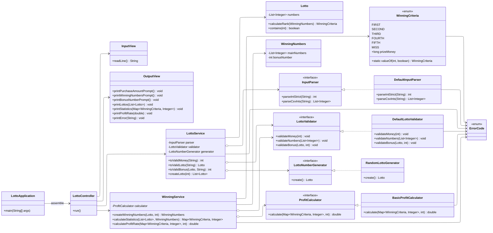

# java-lotto

콘솔에서 로또를 자동 구매하고 당첨 통계를 계산하는 프로그램이다. 사용자는 구입 금액과 당첨 번호를 입력하고, 프로그램은 로또를 발행해 통계와 수익률을 출력한다.

## 요구사항 정리
- 모든 예외 메시지는 `[ERROR]`로 시작한다.
- 잘못된 사용자 입력은 `IllegalArgumentException`으로 처리하고, 내부 오류는 `IllegalStateException`으로 구분한다.
- 입력 실패 시 해당 단계부터 재입력한다.
- 하드코딩 값을 지양하고 의미 있는 상수로 선언한다.
- 한 메서드는 한 가지 역할만 담당하도록 구성한다.

## 시스템 개요
- **로또 구매**: 최소 1,000원, 1,000원 단위의 금액만 허용한다. 금액만큼 로또를 자동 발행한다.
- **로또 번호 규칙**: 1~45 사이의 서로 다른 숫자 6개를 사용한다.
- **당첨 번호 입력**: 쉼표로 구분된 6개 숫자와 보너스 번호 1개를 입력받아 검증한다.
- **통계 계산**: 로또 등수를 집계하고 총 수익률을 계산해 소수 첫째 자리까지 출력한다.

## 실행 환경
- JDK 21 (Gradle Toolchain)
- Gradle Wrapper 8.13
- Mission Utils 1.2.0

## 실행 방법
1. 의존성 다운로드 및 테스트
   ```bash
   ./gradlew clean test
   ```
2. 애플리케이션 실행
   - IDE에서 `lotto.Application`의 `main` 메서드를 실행한다.
   - 또는 빌드 후 `java -cp build/libs/... lotto.Application` 형태로 실행한다.

## 입출력 흐름 예시
```text
구입금액을 입력해 주세요.
8000
8개를 구매했습니다.
[8, 21, 23, 41, 42, 43]
[3, 5, 11, 16, 32, 38]
[7, 11, 16, 35, 36, 44]
[1, 8, 11, 31, 41, 42]
[13, 14, 16, 38, 42, 45]
[7, 11, 30, 40, 42, 43]
[2, 13, 22, 32, 38, 45]
[1, 3, 5, 14, 22, 45]
당첨 번호를 입력해 주세요.
1,2,3,4,5,6
보너스 번호를 입력해 주세요.
7

당첨 통계
---
3개 일치 (5,000원) - 1개
4개 일치 (50,000원) - 0개
5개 일치 (1,500,000원) - 0개
5개 일치, 보너스 볼 일치 (30,000,000원) - 0개
6개 일치 (2,000,000,000원) - 0개
총 수익률은 62.5%입니다.
```

잘못된 입력의 경우 `[ERROR]` 메시지를 출력하고 해당 단계부터 재입력한다.

## 클래스 다이어그램


## 주요 도메인 규칙
- 로또 한 장 가격은 1,000원이며 구입 금액은 1,000원 단위의 양수여야 한다.
- 로또 번호는 1부터 45 사이의 서로 다른 숫자 6개로 구성되며 발행 시 오름차순으로 정렬한다.
- 당첨 번호는 쉼표(`,`)로 구분된 6개 숫자이고 보너스 번호는 단일 숫자로 입력받는다.
- 당첨 등수 및 상금은 다음과 같다.
  - 1등: 6개 번호 일치 / 2,000,000,000원
  - 2등: 5개 번호 + 보너스 번호 일치 / 30,000,000원
  - 3등: 5개 번호 일치 / 1,500,000원
  - 4등: 4개 번호 일치 / 50,000원
  - 5등: 3개 번호 일치 / 5,000원
  - 이외는 낙첨 처리한다.
- 총 수익률은 (총 당첨 금액 ÷ 구입 금액) × 100으로 계산하고 소수 첫째 자리까지 반올림해 출력한다.

## 입출력 흐름
1. **구입 금액 입력**  
   - 숫자가 아니거나 1,000원 단위가 아니면 `[ERROR]` 메시지를 출력하고 재입력 받습니다.
2. **로또 발행 결과 출력**  
   - 구매한 장수와 각 로또 번호(오름차순)를 출력합니다.
3. **당첨 번호 입력**  
   - 쉼표로 구분된 6개의 숫자 입력, 숫자가 아니거나 범위를 벗어나거나 중복이 있으면 예외 처리합니다.
4. **보너스 번호 입력**  
   - 숫자가 아니거나 1~45 범위 밖이거나 당첨 번호와 중복되면 예외 처리합니다.
5. **당첨 통계 및 수익률 출력**

### 예시 실행
```text
구입금액을 입력해 주세요.
8000
8개를 구매했습니다.
[8, 21, 23, 41, 42, 43]
[3, 5, 11, 16, 32, 38]
[7, 11, 16, 35, 36, 44]
[1, 8, 11, 31, 41, 42]
[13, 14, 16, 38, 42, 45]
[7, 11, 30, 40, 42, 43]
[2, 13, 22, 32, 38, 45]
[1, 3, 5, 14, 22, 45]
당첨 번호를 입력해 주세요.
1,2,3,4,5,6
보너스 번호를 입력해 주세요.
7

당첨 통계
---
3개 일치 (5,000원) - 1개
4개 일치 (50,000원) - 0개
5개 일치 (1,500,000원) - 0개
5개 일치, 보너스 볼 일치 (30,000,000원) - 0개
6개 일치 (2,000,000,000원) - 0개
총 수익률은 62.5%입니다.
```

## 예외 처리
- 잘못된 입력이 들어오면 `IllegalArgumentException`을 발생시키고 `[ERROR]`로 시작하는 메시지를 출력한 뒤, 해당 입력부터 다시 받습니다.
- Exception이 아닌 IllegalArgumentException, IllegalStateException 등과 같은 명확한 유형을 처리합니다.
- 주요 검증 항목
  - 구입 금액: 숫자 여부, 1,000원 단위 여부, 1,000원 이상 여부
  - 당첨 번호: 숫자 여부, 범위(1~45), 6개 여부, 중복 여부
  - 보너스 번호: 숫자 여부, 범위(1~45), 당첨 번호와 중복 여부

## 테스트
- `src/test/java/lotto/ApplicationTest`에서 통합 시나리오와 예외 흐름을 검증합니다.
- `src/test/java/lotto/LottoTest`에서 로또 번호 컬렉션의 유효성을 검사합니다.

## 진행 현황 및 TODO
- `lotto.controller.LottoController`를 중심으로 구매, 발행, 검증, 통계를 모두 처리합니다.
- `lotto.service` 패키지는 추후 도메인 로직 분리를 위해 생성된 상태이며, 아직 구현이 완료되지 않았습니다.
